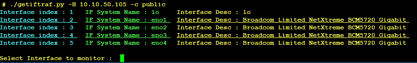
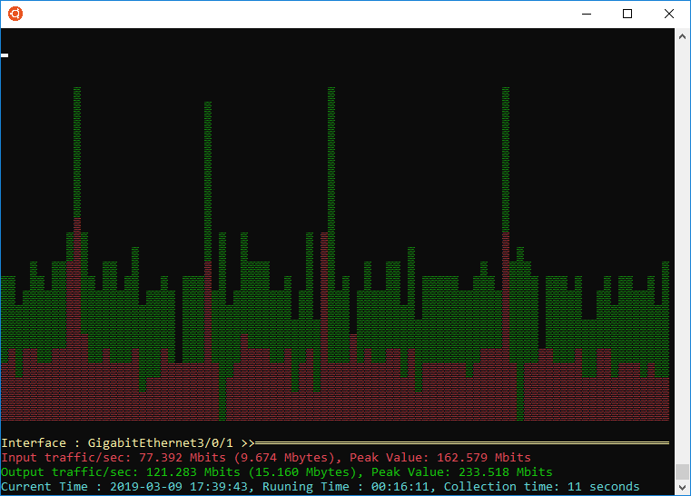

5-10 seconds SNMP Grapher

the program arguments are :<br>

```
  -h, --help            show this help message and exit
  -H HOST, --host HOST  Remote host to connect to
  -p PORT, --port PORT  Port to connect on (optional)
  -c COMMUNITY, --community COMMUNITY
                        SNMP Community
```
<br>
<br>

<br>
<br>
<br>


<br>
extra terminal_color.py for the list of character sequence to generate the terminal text color  

